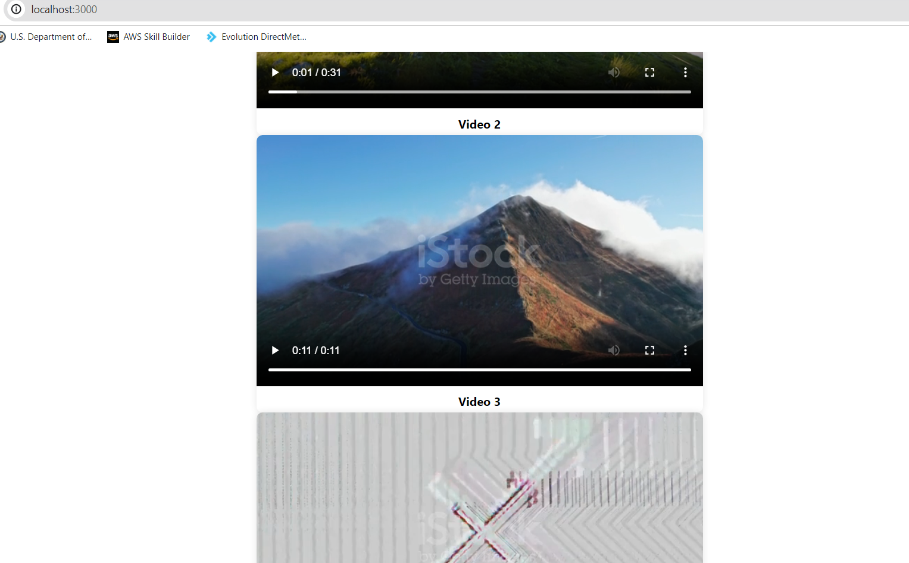

# Pkg Installation
>>npm i dairymilk

# Snapshot

# Info 
It's a simple and compact videref ui component.

# Working
Either it'll work or throw "Your browser doesn't support shit".

# Externals
You'll find func() in func.pkg.

# Tomato
dairymilk dark chocos >>
